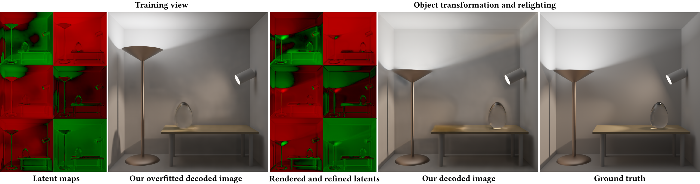

# Latent Rendering

<!-- TODO: Check https://github.com/inttter/md-badges and include a few here -->
[](https://arxiv.org/abs/2609.21054)
[](LICENSE)

[Vuk Radovanovic](https://orcid.org/0009-0008-9271-9149), [Vishesh Gupta](https://orcid.org/0009-0005-3201-9827), [Adrien Gruson](https://profs.etsmtl.ca/agruson/), [Binh-Son Hua](https://sonhua.github.io/)

**Overview.**
This is the code for [Physically Based Rendering in the Latent Space](https://arxiv.org/abs/2609.21054).
In this project, we enable rendering directly into the latent space of a latent diffusion model's (LDM's) pre-trained Variational Autoencoder (VAE).


## Table of Contents

1. [About](#about)
2. [Installation](#installation)
3. [Running](#running)
4. [Configuration](#configuration)
5. [Acknowledgements](#acknowledgements)
6. [License](#license)
7. [Citation](#citation)


## About

Rather than rendering an RGB image and encoding it, we render scenes directly into the latent space of a latent diffusion model's pretrained VAE.

- **Latent rendering.** Our modified Mitsuba 3 adds latent variants (`cuda_ad_latent{4,16,32,64}`). Scene reflectances and emission become signed latent values, rendered with our custom BSDF, emitter and integrator plugins.
- **Scene optimization.** The optimization target is the VAE encoding of a fully converged RGB render. We optimize the latent scene parameters with Mitsuba's Path Replay Backpropagation so that the latent render matches the encoded latent.
- **Neural refinement.** A small convolutional refiner, conditioned on normal and depth AOVs, then corrects the remaining error.

The optimized scene can then be re-rendered in latent space under novel scene states and views, and decoded with the VAE.  By default, we use the SD3.5 VAE, but more VAE configs can be found at `configs/vaes/`.


## Installation

This project depends on a custom fork of Mitsuba 3.  We do not currently package prebuilt versions of this fork, so building from source is required.  **Please ensure that you have all of the Mitsuba build dependencies listed [here](https://mitsuba.readthedocs.io/en/stable/src/developer_guide/compiling.html).**

Then, clone the repository and install its Python dependencies:

```bash
git clone --recursive https://github.com/trinity-graphics/latent-rendering
cd latent-rendering
uv venv

source .venv/bin/activate # on Linux
# OR
.venv\Scripts\activate # on Windows

uv sync
```

Some of the VAEs we tested are gated models on Hugging Face (e.g. [FLUX.2-dev](https://huggingface.co/black-forest-labs/FLUX.2-dev)).  You must log in and accept their licenses, then log in with the HF CLI (`hf auth login`) before using them.

Generating the paper's figures (`scripts/figures.sh`) additionally requires Inkscape and Ghostscript.

## Running

All commands are run from the repo root, and each run writes to `outputs/`.


### Reproducing Paper Results

The helpers in `scripts/` automate the training and testing of the paper's results.

| Script | Runs |
|--------|------|
| `scripts/1_main.sh` | Main ablation and extra scenes |
| `scripts/2_naive.sh` | Naive baseline |
| `scripts/3_vae.sh` | VAE comparison |
| `scripts/4_textured.sh` | Textured interior scenes |
| `scripts/figures.sh` | Figures and tables, from `outputs/` into `figures/` |

### Running a single config

```bash
python -m src.main --config configs/runs/ablation/Lamp-1024-Best.yaml
```

| Flag | Effect |
|------|--------|
| `-o`, `--train_only` | Train only, skipping the test experiments |
| `-r`, `--refiner_training` | Load the optimized scene (by default from `outputs/<out_dir>/scene.pt`) and train only the refiner |
| `-t`, `--test_only` | Test only, using the checkpoints in `outputs/<out_dir>` |


## Configuration

Each run is defined by a YAML file in `configs/runs/`, which inherits config parameters from the following files:

- `configs/base.yaml`: defaults for every run.
- `configs/scenes/`: per-scene settings.
- `configs/methods/`: the ablations and the naive baseline.
- `configs/vaes/`: alternative VAEs.

Any key can be overridden from the command line, e.g. `--num_its 100 --experiments move_camera`.
The most important parameters are listed below.

### Run
| Parameter | Default | Description |
|-----------|---------|-------------|
| `out_dir` | | Output directory. |
| `experiments` | `[move_camera, move_object, move_light]` | Test experiments run after training.  |
| `scene_dir` | | Output directory to load `scene.pt` from if `out_dir` has none. |

### Scene
| Parameter | Default | Description |
|-----------|---------|-------------|
| `scene_file` | | Mitsuba 3 scene XML. |
| `max_depth` | | Maximum path depth. |
| `light_arg`, `object_arg` | | IDs of the light and object moved by the test experiments. |
| `<camera\|light\|object>_<min\|max>_<x\|y\|z>` | `0` | Start and end offsets of each test experiment (camera offsets are azimuth and elevation, in degrees). |

### Method
| Parameter | Default | Description |
|-----------|---------|-------------|
| `negative_rendering` | `true` | Signed rendering with the custom plugins; `false` uses standard PRB. |
| `ambient_term` | `true` | Render the ambient term. |
| `occlusion_term` | `true` | Render the occlusion term. |
| `use_refiner` | `true` | Train and apply the neural refiner. |

### Rendering
| Parameter | Default | Description |
|-----------|---------|-------------|
| `image_resolution` | `1024` | Resolution of the RGB references; latents are rendered at the VAE's latent resolution. |
| `samples_per_pixel` | `3969` | SPP of the RGB references. |
| `samples_per_pixel_latents` | `1024` | SPP of latent renders at test time. |
| `samples_per_pixel_latents_training` | `256` | SPP of latent renders during scene optimization. |
| `tone_map`, `ref_tone_map` | `clip` | Tone map for latent renders and RGB references [`clip`, `reinhard`]. |

### Training
| Parameter | Default | Description |
|-----------|---------|-------------|
| `num_its` | `6000` | Total training iterations. |
| `stage_split` | `0.5` | Percentage of the split between scene/refiner optimization. |
| `lr_min`, `lr_max` | `0.0005`, `0.001` | Learning rate range of the scene optimization's cosine schedule. |
| `lr` | `0.0005` | Fixed refiner learning rate. |
| `loss1_type`, `loss2_type` | `huber`, `mse` | Scene (render) and refiner losses (`huber`, `mse`). |

### Refiner
| Parameter | Default | Description |
|-----------|---------|-------------|
| `refiner_kernels` | `[3, 5, 3]` | Kernel size of each convolutional layer. |
| `expand_ratio` | `16` | Hidden channels, as a multiple of the latent channels. |
| `use_aovs`, `aovs_list` | `true`, `nn:sh_normal,dd:depth` | Condition the refiner on these Mitsuba AOVs. |

### VAE and logging
| Parameter | Default | Description |
|-----------|---------|-------------|
| `model_id` | `stabilityai/stable-diffusion-3.5-medium` | Hugging Face model whose VAE is used (see `configs/vaes/` for the others). |
| `debug_images`, `debug_image_steps` | `true`, `500` | Write debug images to `outputs/<out_dir>/debug` every N training steps. |
| `log`, `team`, `project` | `false`, `null`, `latent` | WandB logging. |


## Acknowledgements

This project builds on [Mitsuba 3](https://github.com/mitsuba-renderer/mitsuba3) and [Dr.Jit](https://github.com/mitsuba-renderer/drjit).
Scenes are from Benedikt Bitterli's [Rendering Resources](https://benedikt-bitterli.me/resources/); see the `LICENSE.txt` in each scene directory for its author and license.

This project is supported by Research Ireland under the Research Ireland Frontiers for the Future Programme - Project, award number 22/FFP-P/11522.

## License

This code is released under the [MIT License](LICENSE).
The scenes in `scenes/` keep their original licenses, and the modified Mitsuba 3 and Dr.Jit keep their own BSD-style licenses.


## Citation

<!-- TODO: update with the published version -->
```bibtex
@article{radovanovic2026latent,
  author  = {Radovanovic, V. and Gupta, V. and Gruson, A. and Hua, B.-S.},
  title   = {{Physically Based Rendering in the Latent Space}},
  journal = {Computer Graphics Forum},
  year    = {2026},
  doi     = {10.1111/cgf.70633},
  note    = {To appear}
}
```
